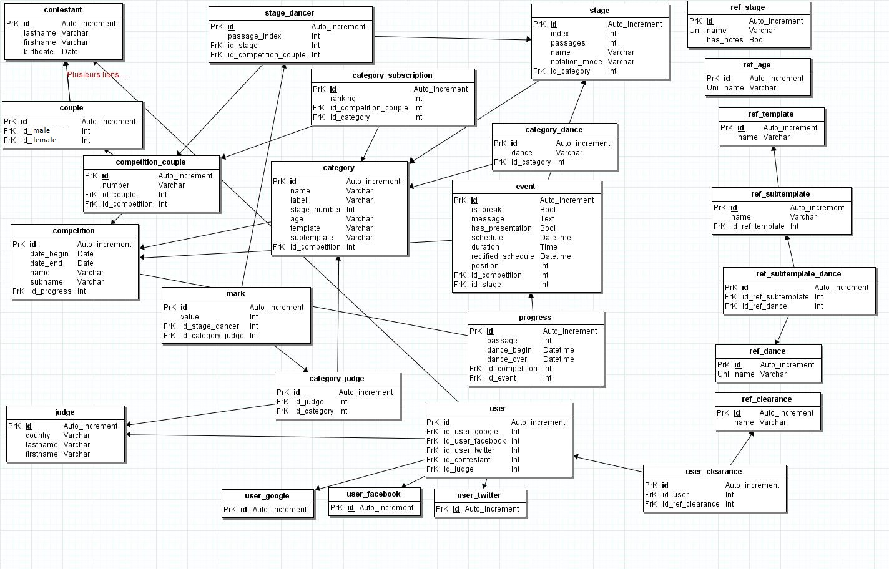

# Roles and actions

## Roles

Roles that interact with the model are defined to be :
- Contestant
- Admin
- Visitor
- Judge
- Organizer

## Role pyramid

Every level has his own actions (clearances) in addition with the layers under it

                                      -Top Admin-
                                  -----Organizer-----
                             ----Contestant-Judge-Help----
                        ----------------Visitor----------------

## Actions per role

### Top Admin
- Grant permissions of Organizer
- Create age, template, subtemplate, dance

### Organizer
Create competitions and manage them :
  - Grant permissions of judge, help
  - Create, modify and delete : categories, events, judges, contestants, stages
  - Handle progress

### Help
- Subpackage (decided par Organizer) of his own actions

### Judge
- Create, modify and delete marks

### Contestant
- Subscribe to a competition
- Subscribe to categories
- Check the conduct
- Create a couple

### Visitor
- Check basic data

## Objects relations & definitions

Object | Definition | Directly Linked | Secondarily Linked
------ | ---------- | --------------- | ------------------
category              | What a couple subscribes to, has a ranking and stages | categorySubscription, categoryDance
categoryDance         | The list of dances a category has | category
categoryJudge         | The judges that can note a category | judge, category, mark | stage, stageDancer
categorySubscription  | The list of contestants in the category, defines a ranking | competitionCouple, category | couple, contestant
competition           | The actual main object, contains everything not global | category, competitionCouple, event, progress | couple, contestant, judge, stage
competitionCouple     | The subscription of a global couple to a competition, defines the couple's number | couple, competition, stageDancer | contestant
contestant            | The global users that can make a couple and subscribe to competitions/categories | competitionCouple | competition, category, stage, stageDancer
couple                | The global couple that can subscribe to competitions and categories | categorySubscription, competitionCouple, stageDancer | category, stage, competition
event                 | The object ordered in a competition venue, represents the timetable | stage, competition | category, competitionCouple, stageDancer, ...
judge                 | Users that can make marks in a stage | categoryJudge | competition, category, stage, stageDancer, mark
mark                  | Object created by categoryJudge to note a stageDancer | categoryJudge, stageDancer | competitionCouple, couple, contestant, judge, category, stage, competition
progress              | the current activity of a competition | categoryDance, event, competition | category, stage
ref_age               | **All referentials are copied, they are not linked to others**
ref_clearance         | **All referentials are copied, they are not linked to others**
ref_dance             | **All referentials are copied, they are not linked to others** | ref_subtemplate | ref_template
ref_notationMode      | **All referentials are copied, they are not linked to others**
ref_stage             | **All referentials are copied, they are not linked to others**
ref_subtemplate       | **All referentials are copied, they are not linked to others** | ref_template, ref_dance
ref_template          | **All referentials are copied, they are not linked to others** | ref_subtemplate | ref_dance
stage                 | The progressing steps of a category | category, event, stageDancer | competitionCouple, contestant, couple, categoryJudge
stageDancer           | The list of couples dancing at a given stage | competitionCouple, stage | couple, contestant, category
user                  | Users that can connect to the application. Links external services with contestants and judges | contestant, judge, userFacebook, userGoogle, userTwitter | couple
userClearance         | List of clearance granted to users  | ref_clearance, user
userFacebook          | Users identified by Facebook        | user
userGoogle            | Users identified by Google          | user
userTwitter           | Users identified by Twitter         | user

## Map of relations

## Detailled calls needed per object
- Referentials
  - Age, Dance, NotationMode, Stage, Template, Subtemplate, Clearance
    - List them
    - In expanded mode, must be complete (template is a two-level lookup)
    - Must be copied (and not referenced)
- Category
  - List them (in a competition)
  - See its couples
  - See its stages
  - See its dances
- Competition
  - List them
  - See its events
  - See its categories
  - See its contestants
  - See its judges (global in competition)
  - See its progress
- Contestant
  - List them
  - See their associations in couples and users
- Couple
  - List them
  - See its subscriptions in competitions
  - See its subscriptions in categories (and results)
  - See its detailled notes
  - See its rounds and passage indexes (and hours)
- Event
  - List them (in a competition)
  - See its category (if exists)
  - See its stage (if exists)
  - See its presentation dance (if exists)
  - See its couples (if exists)
- Judge
  - List them
  - See its competitions
  - See its categories
  - See its stages (and hours)
  - See its notes
- Mark
  - from profile
    - For a judge : only his marks in a stage
    - For a referee : all marks in a stage
    - For a contestant : after competition, his results
- Progress
  - It
- Stage
  -
- User
  -

## API Calls per action

### Calls

 Action              |                             API Call                                            | Permission Required
-------------------- | ------------------------------------------------------------------------------- | -------------------
List Object (global) | `/object` where `object` is age, contestant, couple, dance, judge, stage, template or subtemplate |
Object (global)      | `/object`                       `/new` (POST) or `/:id` (GET, POST & DELETE) where `object` is age, contestant, couple, dance, judge, stage, template or subtemplate | **ADMIN**
Object (global)      | `/competition`                  `/new` (POST) or `/:id` (GET, POST & DELETE) | **HOST**
Object (competition) | `/competition/:id/object`       `/new` (POST) or `/:id` (GET, POST & DELETE) where `object` is category, event or couple | **C_MANAGEMENT**
Judge (competition)  | `/competition/:id/judge`        `/new` (POST) or `/:id` (GET, POST & DELETE) | **C_ADMIN**
Progress             | `/competition/:id/progress` (POST)                                              | **C_PROGRESS**
Object (category)    | `/category/:id/object`          `/new` (POST) or `/:id` (GET, POST & DELETE) where `object` is stage or couple | **C_MANAGEMENT**
Judge (category)     | `/category/:id/stage/:id/judge` `/new` (POST) or `/:id` (GET, POST & DELETE) | **C_ADMIN**
Mark                 | `/category/:id/stage/:id/mark`  `/new` (POST) or `/:id` (GET, POST & DELETE) | **C_REFEREE** (reading all), **C_JUDGE** (CRUD on their own), **C_CONTESTANT** (reading their own after competition is done)
Grant (globally)     | `/grant/:userId/:GlobalACL`                                                     | **ADMIN**
Revoke (globally)    | `/revoke/:userId/:GlobalACL`                                                    | **ADMIN**
Grant (competition)  | `/competition/:id/grant/:userId/:CompetitionACL`                                | **HOST**
Revoke (competition) | `/competition/:id/revoke/:userId/:CompetitionACL`                               | **HOST**

### Permissions types

Permissions are enumerators with the following values:
- *CompetitionACL*
  - __C_PROGRESS__ : Changing progress
  - __C_MANAGEMENT__ : Creating objects
  - __C_JUDGE__ : Creating marks
  - __C_ADMIN__ : Assigning judges
  - __C_REFEREE__ : Consulting marks
  - __C_CONTESTANT__ : Consulting marks
- *GlobalACL*
  - __ADMIN__ : Administrator (no restriction)
  - __HOST__ : Creating competitions, managing and granting permissions to competitions created by you.

Anonymous permissions grant reading on all objects but marks, which require __C_REFEREE__ permissions.

### Objects associations

Some objects can be created globally and in the context of a competition (in the competition directly, and/or in a category, and/or in a stage).
This means that the object must be created globally (i.e. a couple), and then associated with a competition (i.e. the couple has subscribed to the event, has a competition number), and then associated with a round (i.e our couple will dance in the third category up to the semi-finals). This allows for no duplication of data and a simplified user management (the same couple will have the same credentials, and will be recognized across competitions).

### Extended mode

The extended mode is activated through the addition of the URL parameter `extended=true` and is available on most **GET** API calls, where applicable.
What it does is that it returns the value with all of the references to the object.
For example, if you request a certain competition, the standard call (non-extended) will return the object in its simple form : date_begin, date_end, name and subname.
If you request it with the extended mode (`/competition/4?extended=true`), you will get the (most) complete version of the object : previous properties + progress + a list of categories, events, judges, couples that have been associated with the competition. The categories returned, however, won't be extended, which means they will not show their own stages or couples. The other references will not be extended either.